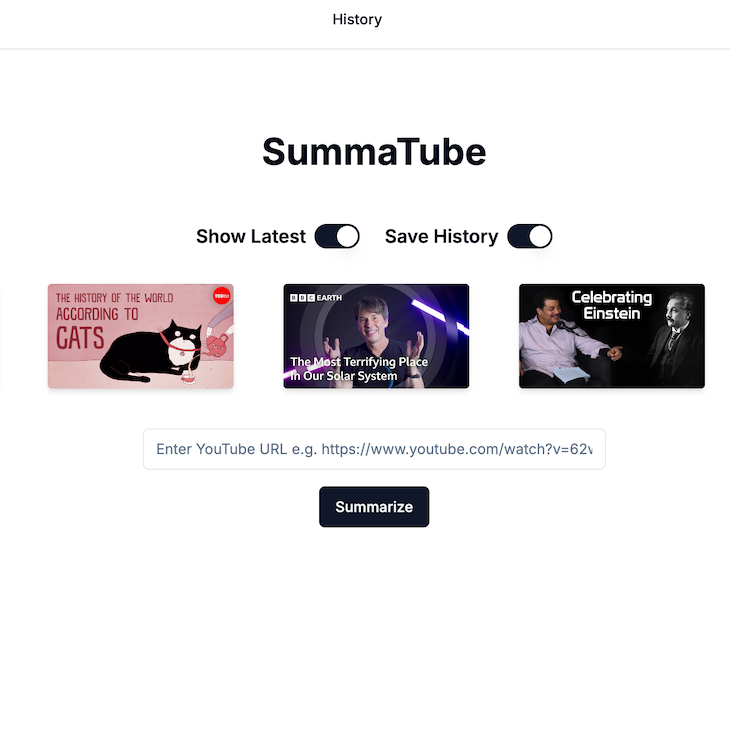

# SummaTube

Summarizes YouTube videos fast + free ⚡️



---

## Features
- Paste a YouTube link → get a clean AI-generated summary  
- Powered by **OpenAI** + **Supabase**  
- Built with **Next.js**  

---

## Installation

### 1. Clone the repository
```bash
git clone https://github.com/adnjoo/summa-tube.git
cd summa-tube/web
````

### 2. Install dependencies

```bash
npm install
# or
yarn install
```

### 3. Environment variables

Create a `.env.local` file in the `web/` folder with the following keys:

```bash
# OpenAI
OPENAI_KEY=your_openai_key_here

# Supabase
NEXT_PUBLIC_SUPABASE_URL=your_supabase_url
NEXT_PUBLIC_SUPABASE_ANON_KEY=your_supabase_anon_key

# Optional (server-only, do NOT expose in NEXT_PUBLIC)
SUPABASE_SERVICE_ROLE_KEY=your_service_role_key
SUPABASE_JWT_SECRET=your_jwt_secret
```

> ⚠️ Only `NEXT_PUBLIC_SUPABASE_URL` and `NEXT_PUBLIC_SUPABASE_ANON_KEY` should be exposed client-side.
> Keep `SUPABASE_SERVICE_ROLE_KEY` and `SUPABASE_JWT_SECRET` for server-side only.

---

## Usage

### Development

```bash
npm run dev
```

Then open [http://localhost:3000](http://localhost:3000) in your browser.

### Production

```bash
npm run build
npm run start
```

---

## Contributing

Contributions are welcome!

* Open an **issue** for bugs or feature requests.
* Submit a **pull request** if you’d like to contribute code.

---

## License

This project is licensed under the **MIT License**.
See the [LICENSE](/LICENSE) file for more information.

---


