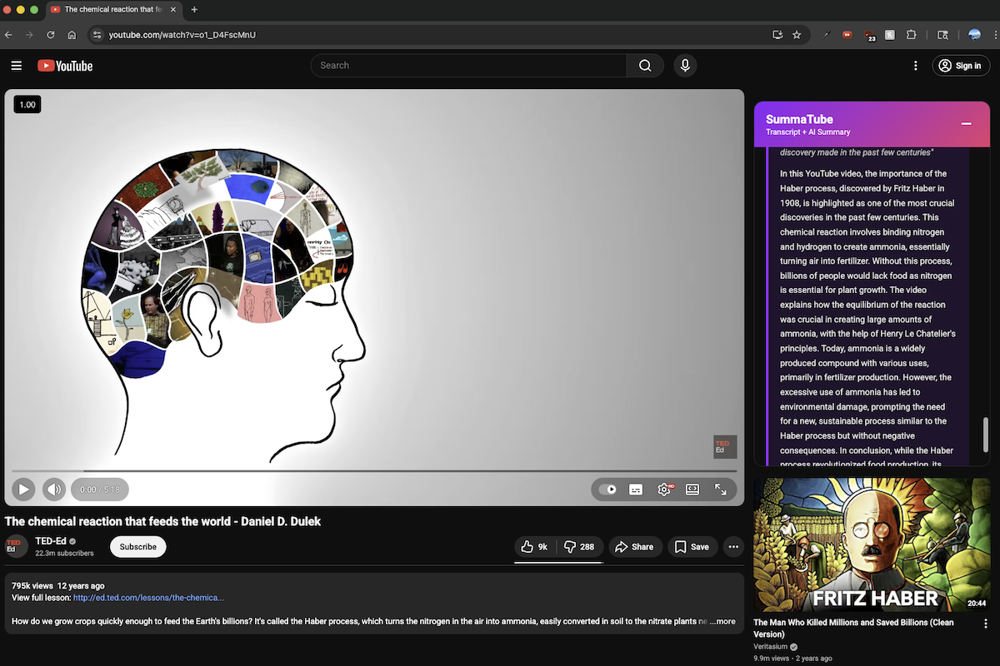

# SummaTube

AI-powered YouTube video summaries and transcripts with clickable timestamps.

## Features

- **Chrome Extension**: Automatically extracts and displays YouTube transcripts
- **AI Summaries**: Generate concise video summaries with one click

## Screenshot

## Installation

### From Chrome Web Store (Recommended)
1. Visit [SummaTube on Chrome Web Store](https://chromewebstore.google.com/detail/summatube-youtube-transcr/fihcdliafahgfgffjjnogmhgaigdjndj?authuser=0&hl=en)
2. Click "Add to Chrome"
3. Confirm installation
4. Visit any YouTube video to see the transcript panel automatically appear

### Manual Installation (Development)
1. Open Chrome and go to `chrome://extensions/`
2. Enable "Developer mode" in the top right
3. Click "Load unpacked" and select the `chrome-ext/` folder
4. Visit any YouTube video to see the transcript panel automatically appear

## License

MIT License - see LICENSE file for details
